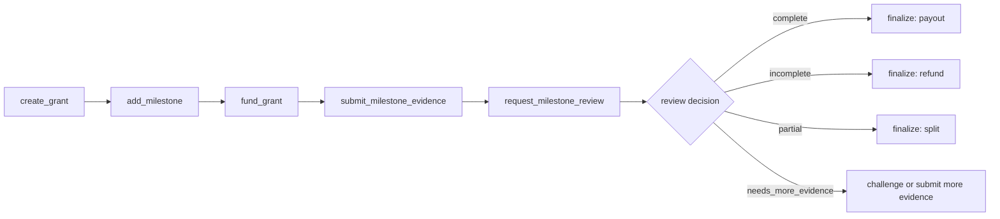

# VeriGrant

**Reusable AI-reviewed milestone grant primitive for GenLayer Intelligent Contracts.**

VeriGrant helps grant sponsors fund milestone-based work and release funds only after evidence-backed, consensus-reviewed completion. A sponsor creates a grant, adds milestones with criteria and payout allocations, funds escrow, receives evidence from the grantee, asks GenLayer validators to review the milestone, and finalizes payout or refund.

The contract is a standalone primitive. It is designed for ecosystem grant programs, DAO funding, hackathon awards, public-goods funding, research milestones, open-source sponsorships, AI-agent work orders, and builder accountability systems.

## Why VeriGrant Exists

Grant programs often fail at the same hard question: did the funded milestone actually get completed?

Most milestone review requires reading public evidence: GitHub repositories, deployed contract addresses, docs pages, test reports, audit notes, API endpoints, screenshots, or written attestations. That evidence is too ambiguous for ordinary deterministic smart contracts.

VeriGrant uses GenLayer's Intelligent Contract model to turn that review process into a reusable on-chain primitive with structured state, escrow accounting, and validator-backed AI adjudication.

## Core Capabilities

- Create reusable grant records.
- Add multiple milestones with independent criteria.
- Allocate milestone payouts in basis points.
- Fund grants through payable escrow.
- Submit text, URL, API, image URL, or attestation evidence.
- Review milestones with GenLayer non-deterministic consensus.
- Store structured JSON review outcomes.
- Finalize milestone payout, refund, or partial release.
- Challenge milestone reviews with bonded counter-evidence.
- Track remaining escrow liability with `accounted_balance()`.

## Repository Layout

```text
contracts/
  veri_grant.py        # Deployable GenLayer Intelligent Contract

docs/
  ARCHITECTURE.md      # State design, storage layout, and consensus model
  DEVELOPER_GUIDE.md   # Integration and Studio usage guide
  USAGE.md             # GenLayer Studio testing guide
  TEST_PLAN.md         # Positive and negative Bradbury test plan
  TEST_REPORT.md       # Final Bradbury deployment and execution evidence
  GENLAYER_NOTES.md    # GenLayer-specific implementation notes

LICENSE
README.md
SECURITY.md
```

## Bradbury Deployment

Final tested deployment:

```text
0x6CD27E9823dE3B7293AeC9C848cF0e1C131D54c9
```

Deployment transaction:

```text
0xb6218d6006b1c0787b5bd18155445c7b958ae945e537d9d92dc03f81f1250362
```

The deployment and both milestone paths were tested on GenLayer Bradbury:

- placeholder evidence was rejected, refunded, and left `accounted_balance()` at `0`;
- valid deployment evidence was accepted, paid out, and left `accounted_balance()` at `0`.

See [docs/TEST_REPORT.md](docs/TEST_REPORT.md) for transaction hashes and final states.

## Developer Documentation

- [Developer Guide](docs/DEVELOPER_GUIDE.md)
- [Architecture](docs/ARCHITECTURE.md)
- [Usage Guide](docs/USAGE.md)
- [Bradbury Test Report](docs/TEST_REPORT.md)
- Documentation site: pending deployment

## Contract Lifecycle

1. Sponsor creates a grant.
2. Sponsor adds one or more milestones.
3. Sponsor funds the grant.
4. Grantee submits milestone evidence.
5. Sponsor or grantee requests milestone review.
6. GenLayer validators evaluate evidence against the milestone criteria.
7. Sponsor or grantee finalizes the reviewed milestone.
8. Funds are paid to the grantee, refunded to the sponsor, or split.



## Public Interface

Write methods:

- `create_grant(grantee, title, grant_spec, review_policy)`
- `add_milestone(grant_id, title, criteria, evidence_schema, allocation_bps, deadline_ts)`
- `fund_grant(grant_id)` payable
- `submit_milestone_evidence(grant_id, milestone_id, evidence_type, uri, description)`
- `request_milestone_review(grant_id, milestone_id)`
- `challenge_milestone_review(grant_id, milestone_id, evidence_type, uri, description)` payable
- `finalize_milestone(grant_id, milestone_id)`
- `cancel_unfunded_grant(grant_id)`
- `expire_milestone(grant_id, milestone_id)`

Read methods:

- `get_grant_count()`
- `get_grant(grant_id)`
- `get_milestone(grant_id, milestone_id)`
- `get_evidence(grant_id, milestone_id, evidence_index)`
- `get_review(grant_id, milestone_id)`
- `contract_balance()`
- `accounted_balance()`

## Review Output

Milestone reviews are normalized into stable fields:

```json
{
  "decision": "complete | incomplete | partial | needs_more_evidence",
  "completion_bps": 10000,
  "payout_bps": 10000,
  "confidence_bps": 9500,
  "reason_codes": ["criteria_satisfied"],
  "evidence_used": ["0"],
  "summary": "..."
}
```

`payout_bps` is denominated against the total grant and cannot exceed the milestone's `allocation_bps`.

## Evidence Types

| Type | Purpose |
| --- | --- |
| `text` | Plain text evidence or written explanation. |
| `url` | Public webpage rendered during review. |
| `api` | Public API endpoint fetched during review. |
| `image_url` | Public visual evidence captured as screenshots. |
| `attestation` | Off-chain or human-readable attestation references. |

## Consensus Design

VeriGrant uses `gl.vm.run_nondet_unsafe(leader_fn, validator_fn)`.

The contract first snapshots grant, milestone, and evidence state into plain data. The leader then fetches bounded public evidence where needed, asks an LLM for structured JSON, and normalizes the result. Validators independently rerun the review and compare stable fields:

- exact `decision`;
- `payout_bps` within tolerance;
- `completion_bps` within tolerance;
- confidence tolerance for complete/incomplete decisions.

This follows GenLayer's Equivalence Principle: validator prose can differ, but state-affecting review fields must agree.

The review helpers are module-level pure functions so the nondeterministic closures do not capture contract storage. This was verified after a Bradbury trace showed storage reads inside nondeterministic mode can cause validator disagreement.

## Escrow Accounting

`contract_balance()` exposes raw `self.balance`. In Studio, raw balance can differ from internal accounting after EOA payout/refund messages.

Use:

```text
accounted_balance()
```

It reports remaining internal escrow liability:

```text
sum(grant.escrowed - grant.paid_out - grant.refunded)
```

After all milestones are finalized or expired, `accounted_balance()` should return `0`.

## GenLayer Features Used

- `gl.Contract`
- `@gl.public.write`, `@gl.public.view`, and payable methods
- `gl.message.value`
- `DynArray` flat storage
- `u256` accounting fields
- `gl.vm.run_nondet_unsafe`
- `gl.nondet.exec_prompt(..., response_format="json")`
- `gl.nondet.web.get(...)`
- `gl.nondet.web.render(...)`
- EOA payout/refund messages through `emit_transfer`

## Documentation References

- [Intelligent Contract Features](https://docs.genlayer.com/developers/intelligent-contracts/features)
- [Non-determinism](https://docs.genlayer.com/developers/intelligent-contracts/features/non-determinism)
- [Web Access](https://docs.genlayer.com/developers/intelligent-contracts/features/web-access)
- [Balances](https://docs.genlayer.com/developers/intelligent-contracts/features/balances)
- [GenLayerJS](https://docs.genlayer.com/api-references/genlayer-js)

## License

MIT
