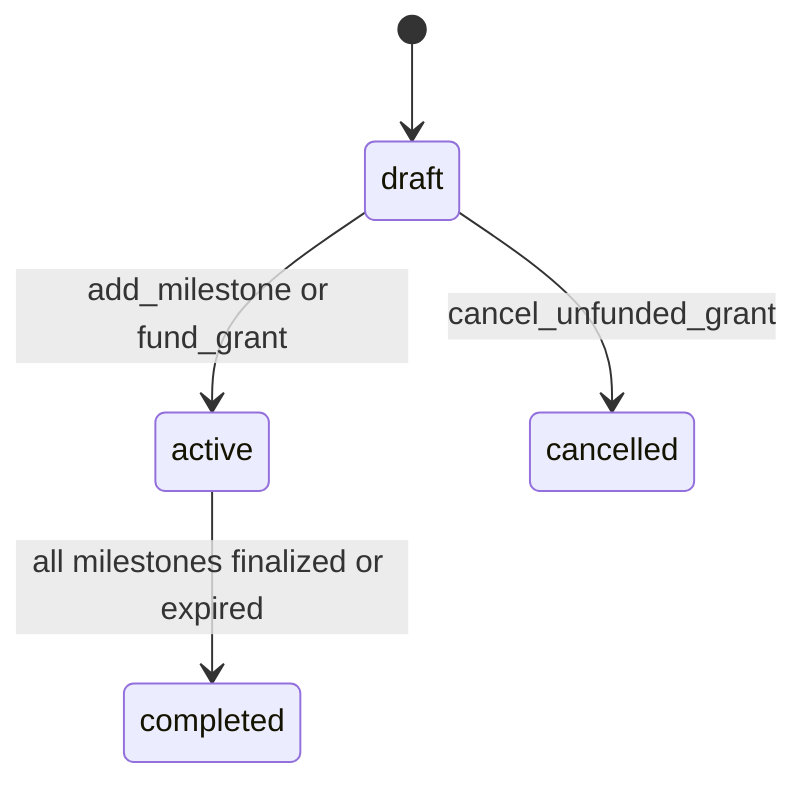
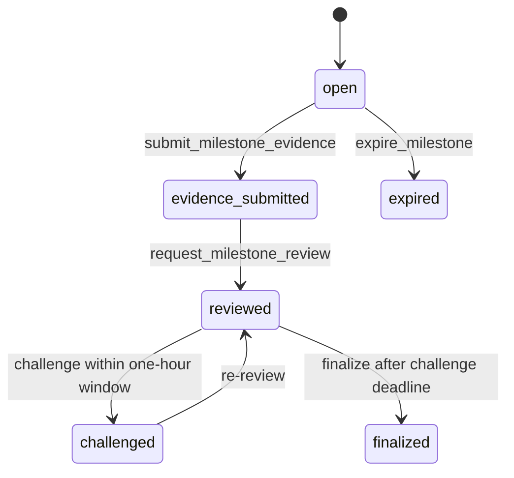

# Architecture

VeriGrant separates deterministic grant accounting from non-deterministic milestone review.

## Design Goals

- Serve as a reusable grant primitive.
- Support multiple grants and milestones.
- Avoid nested dynamic storage.
- Keep milestone review evidence-driven.
- Use structured LLM output.
- Compare stable validator outputs, not raw prose.
- Expose clear escrow liability accounting.

## Data Model

### Grant

```python
class Grant:
    sponsor: Address
    grantee: Address
    title: str
    grant_spec: str
    review_policy: str
    status: str
    created_at: str
    escrowed: u256
    paid_out: u256
    refunded: u256
    milestone_count: u256
    allocation_bps_total: u256
```

### Milestone

```python
class Milestone:
    grant_id: u256
    milestone_id: u256
    title: str
    criteria: str
    evidence_schema: str
    allocation_bps: u256
    deadline_ts: u256
    status: str
    paid_out: u256
    refunded: u256
    evidence_count: u256
    reviewed_at: u256
    challenge_deadline_ts: u256
    challenge_bond: u256
    challenge_count: u256
    review: Review
```

Challenge bonds are stored in a top-level `DynArray[ChallengeBond]` with the
grant and milestone identifiers. This keeps multiple grant and milestone
challenges isolated and lets finalization refund every bond exactly once.

### Evidence

Evidence is stored in a top-level array:

```python
evidence_items: DynArray[EvidenceItem]
```

Each evidence item stores `grant_id` and `milestone_id`. This avoids nested dynamic arrays and stays correct even when multiple grants or milestones receive interleaved evidence.

### Review

```python
class Review:
    decided: bool
    decision: str
    completion_bps: u256
    payout_bps: u256
    confidence_bps: u256
    summary: str
    reason_codes_json: str
    evidence_used_json: str
    decided_at: str
    challenger: Address
```

## State Flow



Milestone state:



## Review Flow

`request_milestone_review` calls `_review_milestone`, which uses:

```python
gl.vm.run_nondet_unsafe(leader_fn, validator_fn)
```

The leader:

1. Builds a deterministic snapshot of grant, milestone, and evidence state.
2. Fetches bounded evidence excerpts for URL/API/image evidence.
3. Calls an LLM with `response_format="json"`.
4. Normalizes and bounds the result.

The validator reruns the same process and compares stable fields.

## Equivalence Checks

Two reviews are considered equivalent when:

- `decision` matches exactly.
- `payout_bps` matches exactly, because it determines the escrow transfer.
- `completion_bps` differs by no more than 1500 bps.
- confidence for complete/incomplete decisions differs by no more than 2500 bps.

## Payout Model

Each milestone has an `allocation_bps` against the total grant. Review output contains `payout_bps`, also denominated against the total grant and bounded to the milestone allocation.

Finalization calculates:

```text
allocated = grant.escrowed * milestone.allocation_bps / 10000
payout = grant.escrowed * review.payout_bps / 10000
refund = allocated - payout
```

When all milestones are finalized or expired, any remaining unallocated escrow is refunded to the sponsor and the grant becomes `completed`.

## Safety Boundaries

- Grant creation is non-payable for Studio compatibility.
- Funding is explicit through `fund_grant`.
- Review is blocked until escrow exists.
- Payout cannot exceed milestone allocation.
- Finalization is rejected while `challenge_deadline_ts` is in the future.
- Every review starts a one-hour challenge window; each challenge resets it.
- At most two bonded challenge rounds are accepted per milestone.
- Challenge bonds are excluded from milestone payout allocation and refunded
  exactly once at finalization.
- Milestone allocations cannot exceed 10000 bps per grant.
- Evidence count and field sizes are bounded.
- Web evidence excerpts and image evidence are bounded.
- Worker submissions are blocked after deadline when `deadline_ts > 0`.
